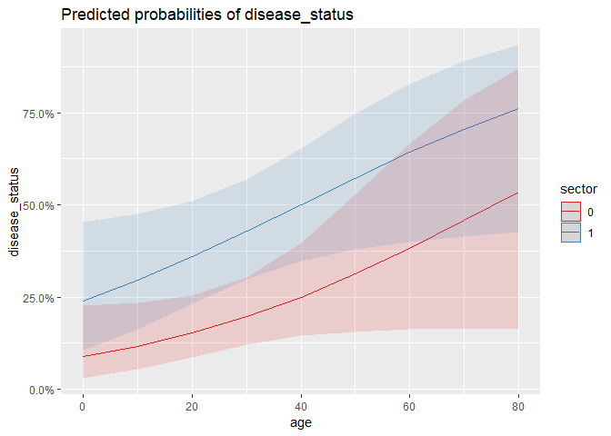

Disease Outbreak Analysis
================
Anne (Annie) Lott
April 12, 2019

To control an epidemic, it is important to determine what variables are related to disease occurrence. In this project I evaluate data on a dengue epidemic in a Mexican city to identify factors that increased or decreased the odds of contracting the disease. I apply logistic regression to all independent variables (excluding identification number) to predict disease status. I also implement the Naive Bayes method to detect which variables may be associated with dengue incidence.

``` r
#set working directory where data is located
#read in data
dengue = read.table(file = "disease_outbreak.txt", sep = "",
                    header = FALSE)

#create column names
colnames(dengue) = c("id", "age", "socioeconomic_status",
                     "sector", "disease_status", 
                     "savings_account_status")

#recode sector as a 0 if in sector 1, 1 if in sector 2
dengue$sector = ifelse(dengue$sector == 1, 0, 1)

#set socioeconomic_status, sector, disease_status
#and savings_account_status as factors
dengue$socioeconomic_status = as.factor(dengue$socioeconomic_status)
dengue$sector = as.factor(dengue$sector)
dengue$disease_status = as.factor(dengue$disease_status)
dengue$savings_account_status = as.factor(dengue$savings_account_status)

#randomly partition data into a training and validation set
#set seed first
set.seed(123)
train.rows = sample(rownames(dengue), floor(nrow(dengue)*0.7))
train.data = dengue[as.numeric(train.rows),]
valid.data = dengue[-as.numeric(train.rows),]

#apply logistic regression to all predictors but id
logit.reg = glm(disease_status ~ . -id, 
                data = train.data, 
                family = "binomial")
summary(logit.reg)
```

    ## 
    ## Call:
    ## glm(formula = disease_status ~ . - id, family = "binomial", data = train.data)
    ## 
    ## Deviance Residuals: 
    ##     Min       1Q   Median       3Q      Max  
    ## -1.6738  -0.7811  -0.5525   0.8915   2.1654  
    ## 
    ## Coefficients:
    ##                         Estimate Std. Error z value Pr(>|z|)    
    ## (Intercept)             -2.66655    0.60122  -4.435  9.2e-06 ***
    ## age                      0.02898    0.01125   2.575  0.01003 *  
    ## socioeconomic_status2    0.22233    0.57278   0.388  0.69790    
    ## socioeconomic_status3    0.54532    0.51529   1.058  0.28994    
    ## sector1                  1.19337    0.43904   2.718  0.00657 ** 
    ## savings_account_status1  0.16218    0.49173   0.330  0.74155    
    ## ---
    ## Signif. codes:  0 '***' 0.001 '**' 0.01 '*' 0.05 '.' 0.1 ' ' 1
    ## 
    ## (Dispersion parameter for binomial family taken to be 1)
    ## 
    ##     Null deviance: 161.78  on 136  degrees of freedom
    ## Residual deviance: 142.64  on 131  degrees of freedom
    ## AIC: 154.64
    ## 
    ## Number of Fisher Scoring iterations: 4

``` r
round(data.frame(summary(logit.reg)$coefficients, 
                 odds = exp(coef(logit.reg))), 5)
```

    ##                         Estimate Std..Error  z.value Pr...z..    odds
    ## (Intercept)             -2.66655    0.60122 -4.43525  0.00001 0.06949
    ## age                      0.02898    0.01125  2.57486  0.01003 1.02940
    ## socioeconomic_status2    0.22233    0.57278  0.38816  0.69790 1.24898
    ## socioeconomic_status3    0.54532    0.51529  1.05826  0.28994 1.72515
    ## sector1                  1.19337    0.43904  2.71813  0.00657 3.29819
    ## savings_account_status1  0.16218    0.49173  0.32981  0.74155 1.17607

At an alpha of 0.1, the variables of age and sector of city are significantly related to disease occurrence. Controlling for all other variables, a one year increase in age increased the odds of contracting dengue by around 3%. In addition, a person living in sector 2 had an estimated 3.3 times higher odds of contracting dengue than a person living in sector 1, with all other variables held constant. These results indicate that the disease incidence depended on geography, and that increased age may have made people more susceptible to contracting dengue.

``` r
#use step to select variables
step.fwd = step(logit.reg, direction = "forward")
```

    ## Start:  AIC=154.64
    ## disease_status ~ (id + age + socioeconomic_status + sector + 
    ##     savings_account_status) - id

``` r
step.bwd = step(logit.reg, direction = "backward")
```

    ## Start:  AIC=154.64
    ## disease_status ~ (id + age + socioeconomic_status + sector + 
    ##     savings_account_status) - id
    ## 
    ##                          Df Deviance    AIC
    ## - socioeconomic_status    2   143.78 151.78
    ## - savings_account_status  1   142.75 152.75
    ## <none>                        142.64 154.64
    ## - age                     1   149.73 159.73
    ## - sector                  1   150.28 160.28
    ## 
    ## Step:  AIC=151.79
    ## disease_status ~ age + sector + savings_account_status
    ## 
    ##                          Df Deviance    AIC
    ## - savings_account_status  1   143.79 149.79
    ## <none>                        143.78 151.78
    ## - sector                  1   150.83 156.83
    ## - age                     1   151.35 157.35
    ## 
    ## Step:  AIC=149.79
    ## disease_status ~ age + sector
    ## 
    ##          Df Deviance    AIC
    ## <none>        143.79 149.79
    ## - sector  1   151.39 155.39
    ## - age     1   152.10 156.10

``` r
step.both = step(logit.reg, direction = "both")
```

    ## Start:  AIC=154.64
    ## disease_status ~ (id + age + socioeconomic_status + sector + 
    ##     savings_account_status) - id
    ## 
    ##                          Df Deviance    AIC
    ## - socioeconomic_status    2   143.78 151.78
    ## - savings_account_status  1   142.75 152.75
    ## <none>                        142.64 154.64
    ## - age                     1   149.73 159.73
    ## - sector                  1   150.28 160.28
    ## 
    ## Step:  AIC=151.79
    ## disease_status ~ age + sector + savings_account_status
    ## 
    ##                          Df Deviance    AIC
    ## - savings_account_status  1   143.79 149.79
    ## <none>                        143.78 151.78
    ## + socioeconomic_status    2   142.64 154.64
    ## - sector                  1   150.83 156.83
    ## - age                     1   151.35 157.35
    ## 
    ## Step:  AIC=149.79
    ## disease_status ~ age + sector
    ## 
    ##                          Df Deviance    AIC
    ## <none>                        143.79 149.79
    ## + savings_account_status  1   143.78 151.78
    ## + socioeconomic_status    2   142.75 152.75
    ## - sector                  1   151.39 155.39
    ## - age                     1   152.10 156.10

``` r
#compare the results of the different variable selection procedures
summary(step.fwd)
```

    ## 
    ## Call:
    ## glm(formula = disease_status ~ (id + age + socioeconomic_status + 
    ##     sector + savings_account_status) - id, family = "binomial", 
    ##     data = train.data)
    ## 
    ## Deviance Residuals: 
    ##     Min       1Q   Median       3Q      Max  
    ## -1.6738  -0.7811  -0.5525   0.8915   2.1654  
    ## 
    ## Coefficients:
    ##                         Estimate Std. Error z value Pr(>|z|)    
    ## (Intercept)             -2.66655    0.60122  -4.435  9.2e-06 ***
    ## age                      0.02898    0.01125   2.575  0.01003 *  
    ## socioeconomic_status2    0.22233    0.57278   0.388  0.69790    
    ## socioeconomic_status3    0.54532    0.51529   1.058  0.28994    
    ## sector1                  1.19337    0.43904   2.718  0.00657 ** 
    ## savings_account_status1  0.16218    0.49173   0.330  0.74155    
    ## ---
    ## Signif. codes:  0 '***' 0.001 '**' 0.01 '*' 0.05 '.' 0.1 ' ' 1
    ## 
    ## (Dispersion parameter for binomial family taken to be 1)
    ## 
    ##     Null deviance: 161.78  on 136  degrees of freedom
    ## Residual deviance: 142.64  on 131  degrees of freedom
    ## AIC: 154.64
    ## 
    ## Number of Fisher Scoring iterations: 4

``` r
summary(step.bwd)
```

    ## 
    ## Call:
    ## glm(formula = disease_status ~ age + sector, family = "binomial", 
    ##     data = train.data)
    ## 
    ## Deviance Residuals: 
    ##     Min       1Q   Median       3Q      Max  
    ## -1.6993  -0.7807  -0.5620   0.8555   2.0770  
    ## 
    ## Coefficients:
    ##             Estimate Std. Error z value Pr(>|z|)    
    ## (Intercept) -2.30232    0.42243  -5.450 5.03e-08 ***
    ## age          0.02982    0.01062   2.809  0.00497 ** 
    ## sector1      1.12109    0.41062   2.730  0.00633 ** 
    ## ---
    ## Signif. codes:  0 '***' 0.001 '**' 0.01 '*' 0.05 '.' 0.1 ' ' 1
    ## 
    ## (Dispersion parameter for binomial family taken to be 1)
    ## 
    ##     Null deviance: 161.78  on 136  degrees of freedom
    ## Residual deviance: 143.79  on 134  degrees of freedom
    ## AIC: 149.79
    ## 
    ## Number of Fisher Scoring iterations: 4

``` r
summary(step.both)
```

    ## 
    ## Call:
    ## glm(formula = disease_status ~ age + sector, family = "binomial", 
    ##     data = train.data)
    ## 
    ## Deviance Residuals: 
    ##     Min       1Q   Median       3Q      Max  
    ## -1.6993  -0.7807  -0.5620   0.8555   2.0770  
    ## 
    ## Coefficients:
    ##             Estimate Std. Error z value Pr(>|z|)    
    ## (Intercept) -2.30232    0.42243  -5.450 5.03e-08 ***
    ## age          0.02982    0.01062   2.809  0.00497 ** 
    ## sector1      1.12109    0.41062   2.730  0.00633 ** 
    ## ---
    ## Signif. codes:  0 '***' 0.001 '**' 0.01 '*' 0.05 '.' 0.1 ' ' 1
    ## 
    ## (Dispersion parameter for binomial family taken to be 1)
    ## 
    ##     Null deviance: 161.78  on 136  degrees of freedom
    ## Residual deviance: 143.79  on 134  degrees of freedom
    ## AIC: 149.79
    ## 
    ## Number of Fisher Scoring iterations: 4

Backward variable selection and both-way stepwise variable selection both outputted the same model, including only age and sector of the city as variables. Forward variable selection included all variables within the model, but had a higher AIC score than the model chosen by backward and both-way stepwise regression. Moving forward, I only consider age and sector in my model, while also investigating a potential interaction effect between age and sector. An interaction effect would mean that the odds of contracting dengue with increasing age would vary by sector.

``` r
#fit model with age, sector, and interaction effect of age and sector
logit.reg2 = glm(disease_status ~ age + sector + age*sector, 
                 data = train.data, family = "binomial")

#look at interaction effect plot
library(sjPlot)
library(sjmisc)
library(ggplot2)
plot_model(logit.reg2, type = "pred", terms = c("age", "sector"))
```



There seems to be no evidence of an interaction effect between age and sector based on the plot of the predicted probabilites of disease occurrence versus age based on sector, as the lines in the plot are parallel.

``` r
#use variable selection to determine if interaction effect
#should be included
step.fwd2 = step(logit.reg2, direction = "forward",
                 scope = list(upper = ~ 0 +age + sector + age*sector,
                              lower = ~ 0 + age+ sector))
```

    ## Start:  AIC=151.78
    ## disease_status ~ age + sector + age * sector

``` r
step.bwd2 = step(logit.reg2, direction = "backward",
                 scope = list(upper = ~ 0 +age + sector + age*sector,
                              lower = ~ 0 + age+ sector))
```

    ## Start:  AIC=151.78
    ## disease_status ~ age + sector + age * sector
    ## 
    ##              Df Deviance    AIC
    ## - age:sector  1   143.79 149.79
    ## <none>            143.78 151.78
    ## 
    ## Step:  AIC=149.79
    ## disease_status ~ age + sector

``` r
step.both2 = step(logit.reg2, direction = "both",
                 scope = list(upper = ~ 0 +age + sector + age*sector,
                              lower = ~ 0 + age+ sector))
```

    ## Start:  AIC=151.78
    ## disease_status ~ age + sector + age * sector
    ## 
    ##              Df Deviance    AIC
    ## - age:sector  1   143.79 149.79
    ## <none>            143.78 151.78
    ## 
    ## Step:  AIC=149.79
    ## disease_status ~ age + sector
    ## 
    ##              Df Deviance    AIC
    ## <none>            143.79 149.79
    ## + age:sector  1   143.78 151.78

``` r
#compare the results of the variable selection procedures
summary(step.fwd2)
```

    ## 
    ## Call:
    ## glm(formula = disease_status ~ age + sector + age * sector, family = "binomial", 
    ##     data = train.data)
    ## 
    ## Deviance Residuals: 
    ##     Min       1Q   Median       3Q      Max  
    ## -1.6822  -0.7871  -0.5588   0.8659   2.0866  
    ## 
    ## Coefficients:
    ##              Estimate Std. Error z value Pr(>|z|)    
    ## (Intercept) -2.335138   0.564779  -4.135 3.56e-05 ***
    ## age          0.030956   0.016699   1.854   0.0638 .  
    ## sector1      1.176738   0.753116   1.562   0.1182    
    ## age:sector1 -0.001907   0.021603  -0.088   0.9297    
    ## ---
    ## Signif. codes:  0 '***' 0.001 '**' 0.01 '*' 0.05 '.' 0.1 ' ' 1
    ## 
    ## (Dispersion parameter for binomial family taken to be 1)
    ## 
    ##     Null deviance: 161.78  on 136  degrees of freedom
    ## Residual deviance: 143.78  on 133  degrees of freedom
    ## AIC: 151.78
    ## 
    ## Number of Fisher Scoring iterations: 4

``` r
summary(step.bwd2)
```

    ## 
    ## Call:
    ## glm(formula = disease_status ~ age + sector, family = "binomial", 
    ##     data = train.data)
    ## 
    ## Deviance Residuals: 
    ##     Min       1Q   Median       3Q      Max  
    ## -1.6993  -0.7807  -0.5620   0.8555   2.0770  
    ## 
    ## Coefficients:
    ##             Estimate Std. Error z value Pr(>|z|)    
    ## (Intercept) -2.30232    0.42243  -5.450 5.03e-08 ***
    ## age          0.02982    0.01062   2.809  0.00497 ** 
    ## sector1      1.12109    0.41062   2.730  0.00633 ** 
    ## ---
    ## Signif. codes:  0 '***' 0.001 '**' 0.01 '*' 0.05 '.' 0.1 ' ' 1
    ## 
    ## (Dispersion parameter for binomial family taken to be 1)
    ## 
    ##     Null deviance: 161.78  on 136  degrees of freedom
    ## Residual deviance: 143.79  on 134  degrees of freedom
    ## AIC: 149.79
    ## 
    ## Number of Fisher Scoring iterations: 4

``` r
summary(step.both2)
```

    ## 
    ## Call:
    ## glm(formula = disease_status ~ age + sector, family = "binomial", 
    ##     data = train.data)
    ## 
    ## Deviance Residuals: 
    ##     Min       1Q   Median       3Q      Max  
    ## -1.6993  -0.7807  -0.5620   0.8555   2.0770  
    ## 
    ## Coefficients:
    ##             Estimate Std. Error z value Pr(>|z|)    
    ## (Intercept) -2.30232    0.42243  -5.450 5.03e-08 ***
    ## age          0.02982    0.01062   2.809  0.00497 ** 
    ## sector1      1.12109    0.41062   2.730  0.00633 ** 
    ## ---
    ## Signif. codes:  0 '***' 0.001 '**' 0.01 '*' 0.05 '.' 0.1 ' ' 1
    ## 
    ## (Dispersion parameter for binomial family taken to be 1)
    ## 
    ##     Null deviance: 161.78  on 136  degrees of freedom
    ## Residual deviance: 143.79  on 134  degrees of freedom
    ## AIC: 149.79
    ## 
    ## Number of Fisher Scoring iterations: 4

The variable selection methods that excluded the interaction term resulted in models with lower AICs, so I will drop the interaction between age and sector in my final model.

``` r
#build the final logistic regression model on the training data
logit.final = glm(disease_status~ age + sector, data = train.data,
                  family = "binomial")

#predict the probabilities of disease incidence
probs = predict(logit.final, valid.data)

#if probability of disease exceeds 0.5, classify as diseased,
#otherwise classify as not diseased
preds = ifelse(probs > 0.5, 1, 0)

#create a confusion matrix of the results
library(caret)
confusionMatrix(as.factor(preds), valid.data$disease_status, positive = "1")
```

    ## Confusion Matrix and Statistics
    ## 
    ##           Reference
    ## Prediction  0  1
    ##          0 40 18
    ##          1  0  1
    ##                                           
    ##                Accuracy : 0.6949          
    ##                  95% CI : (0.5613, 0.8081)
    ##     No Information Rate : 0.678           
    ##     P-Value [Acc > NIR] : 0.4512          
    ##                                           
    ##                   Kappa : 0.0701          
    ##  Mcnemar's Test P-Value : 6.151e-05       
    ##                                           
    ##             Sensitivity : 0.05263         
    ##             Specificity : 1.00000         
    ##          Pos Pred Value : 1.00000         
    ##          Neg Pred Value : 0.68966         
    ##              Prevalence : 0.32203         
    ##          Detection Rate : 0.01695         
    ##    Detection Prevalence : 0.01695         
    ##       Balanced Accuracy : 0.52632         
    ##                                           
    ##        'Positive' Class : 1               
    ## 

My final model has a very low sensitivity, meaning it can't correctly classify people who had the disease. This model is most likely weak because strong variables that are associated with disease occurrence, such as use of mosquito nets, are not included in the data.

I will now implement the Naive Bayes procedure on the training data while excluding the age and id variables, as Naive Bayes only works for categorical variables.

``` r
library(e1071)

#run Naive Bayes
nb.model = naiveBayes(disease_status ~ .-id -age, data = train.data)

#predict the class
preds.nb = predict(nb.model, newdata = valid.data)

#create a confusion matrix of the results
confusionMatrix(as.factor(preds.nb), valid.data$disease_status, 
                positive = "1")
```

    ## Confusion Matrix and Statistics
    ## 
    ##           Reference
    ## Prediction  0  1
    ##          0 36 16
    ##          1  4  3
    ##                                           
    ##                Accuracy : 0.661           
    ##                  95% CI : (0.5261, 0.7792)
    ##     No Information Rate : 0.678           
    ##     P-Value [Acc > NIR] : 0.66682         
    ##                                           
    ##                   Kappa : 0.0694          
    ##  Mcnemar's Test P-Value : 0.01391         
    ##                                           
    ##             Sensitivity : 0.15789         
    ##             Specificity : 0.90000         
    ##          Pos Pred Value : 0.42857         
    ##          Neg Pred Value : 0.69231         
    ##              Prevalence : 0.32203         
    ##          Detection Rate : 0.05085         
    ##    Detection Prevalence : 0.11864         
    ##       Balanced Accuracy : 0.52895         
    ##                                           
    ##        'Positive' Class : 1               
    ## 

The sensitivity of the Naive Bayes model is also quite low. Therefore, although I can conclude that age and sector are related to dengue incidence, there is little predictive power in models including these variables, because their association with the occurrence of dengue is somewhat weak.
